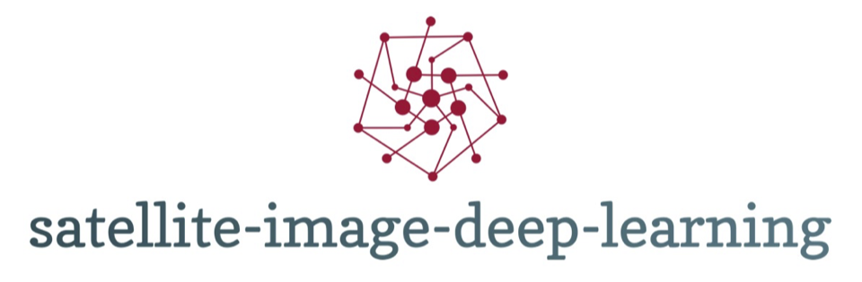

  

    

  <h2>Training and deployment of deep learning models applied to satellite and aerial imagery.</h2>

# 👉 [satellite-image-deep-learning.com](https://www.satellite-image-deep-learning.com/) 👈

# Model training best practice
* Almost all imagery data on the internet is in 3 band RGB format, and model training code often requires adaptation to work with multiband data (e.g. 13-band Sentinel 2). Typically this involves updating the number of channels accepted by the first layer of the model, but there are also challenges related to data normalisation
* In general, classification and object detection models are treated using transfer learning, where the majority of the weights are not updated in training but have been pre computed using standard vision datasets such as ImageNet
* Since satellite images are typically very large, it is common to chip/tile them before processing. Alternatively checkout [Fully Convolutional Image Classification on Arbitrary Sized Image](https://learnopencv.com/fully-convolutional-image-classification-on-arbitrary-sized-image/) -> TLDR replace the fully-connected layer with a convolution-layer
* Use image augmentation in train and val, but not test
* In general, larger models will outperform smaller models, but require larger training datasets. Start with a small model to establish baseline then increase the size
* If model performance in unsatisfactory, try to increase your dataset size before switching to exotic model architectures
* In training, whenever possible increase the batch size, as small batch sizes produce poor normalization statistics
* The vast majority of the literature uses supervised learning with the requirement for large volumes of annotated data, which is a bottleneck to development and deployment. We are just starting to see self-supervised approaches applied to remote sensing data
* For general guidance on dataset size see [this issue](https://github.com/ultralytics/yolov5/issues/3306)
* Read [A Recipe for Training Neural Networks](http://karpathy.github.io/2019/04/25/recipe/) by Andrej Karpathy
* [Seven steps towards a satellite imagery dataset](https://omdena.com/blog/satellite-imagery-dataset/)
* [How to implement augmentations for Multispectral Satellite Images Segmentation using Fastai-v2 and Albumentations](https://towardsdatascience.com/how-to-implement-augmentations-for-multispectral-satellite-images-segmentation-using-fastai-v2-and-ea3965736d1)
* [Leveraging Geolocation Data for Machine Learning: Essential Techniques](https://towardsdatascience.com/leveraging-geolocation-data-for-machine-learning-essential-techniques-192ce3a969bc) -> A Gentle Guide to Feature Engineering and Visualization with Geospatial data, in Plain English
* [Image Classification Labeling: Single Class versus Multiple Class Projects](https://www.azavea.com/blog/2020/06/08/image-classification-labeling-single-class-versus-multiple-class-projects/)
* [Image Augmentations for Aerial Datasets](https://blog.roboflow.com/image-augmentations-for-aerial-datasets/)
* [Using TensorBoard While Training Land Cover Models with Satellite Imagery](https://up42.com/blog/tech/using-tensorboard-while-training-land-cover-models-with-satellite-imagery)
* [Visualise Embeddings with Tensorboard](https://medium.com/gsi-technology/visualising-embeddings-using-t-sne-8fd4e31b56e2) -> also checkout the [Tensorflow Embedding Projector](https://projector.tensorflow.org/)
* [Introduction to Satellite Image Augmentation with Generative Adversarial Networks - video](https://geoawesomeness.com/introduction-to-satellite-image-augmentation-with-generative-adversarial-networks/)
* [Use Gradio and W&B together to monitor training and view predictions](https://wandb.ai/abidlabs/your-test-project/reports/How-Gradio-and-W-B-Work-Beautifully-Together---Vmlldzo4MTk0MzI)
* [Every important satellite imagery analysis project is challenging, but here are ten straightforward steps to get started](https://medium.com/futuring-peace/how-to-change-the-world-from-space-d4186e76da43)
* [Challenges with SpaceNet 4 off-nadir satellite imagery: Look angle and target azimuth angle](https://medium.com/the-downlinq/challenges-with-spacenet-4-off-nadir-satellite-imagery-look-angle-and-target-azimuth-angle-2402bc4c3cf6) -> building prediction in images taken at nearly identical look angles — for example, 29 and 30 degrees — produced radically different performance scores.
* [How not to test your deep learning algorithm?](https://medium.com/earthcube-stories/how-not-to-test-your-deep-learning-algorithm-c435993f873b) - bad ideas to avoid
* [AI products and remote sensing: yes, it is hard and yes, you need a good infra](https://medium.com/earthcube-stories/ai-products-and-remote-sensing-yes-it-is-hard-and-yes-you-need-a-good-infra-4b5d6cf822f1) -> advice on building an in-house data annotation service
* [Boosting object detection performance through ensembling on satellite imagery](https://medium.com/earthcube-stories/boosting-object-detection-performance-through-ensembling-on-satellite-imagery-949e891dfb28)
* [How to use deep learning on satellite imagery — Playing with the loss function](https://medium.com/earthcube-stories/techsecret-how-to-use-deep-learning-on-satellite-imagery-episode-1-playing-with-the-loss-8fc05c90a63a)
* [On the importance of proper data handling](https://medium.com/picterra/on-the-importance-of-proper-data-handling-part-1-b78e4bfd9a7c)
* [Generate SSD anchor box aspect ratios using k-means clustering](https://github.com/tensorflow/models/blob/master/research/object_detection/colab_tutorials/generate_ssd_anchor_box_aspect_ratios_using_k_means_clustering.ipynb) -> tutorial showing how to discover a set of aspect ratios that are custom-fit for your dataset, applied to tensorflow object detection
* [Transfer Learning on Greyscale Images: How to Fine-Tune Pretrained Models on Black-and-White Datasets](https://towardsdatascience.com/transfer-learning-on-greyscale-images-how-to-fine-tune-pretrained-models-on-black-and-white-9a5150755c7a)
* [How to create a DataBlock for Multispectral Satellite Image Segmentation with the Fastai](https://towardsdatascience.com/how-to-create-a-datablock-for-multispectral-satellite-image-segmentation-with-the-fastai-v2-bc5e82f4eb5)
* [A comprehensive list of ML and AI acronyms and abbreviations](https://github.com/AgaMiko/machine-learning-acronyms)
* [Finding an optimal number of “K” classes for unsupervised classification on Remote Sensing Data](https://medium.com/@tobyzawthuhtet/finding-an-optimal-number-of-k-classes-for-unsupervised-classification-on-remote-sensing-data-35a5faa0a608) -> i.e 'elbow' method
* Supplement your training data with 'negative' examples which are created through random selection of regions of the image that contain no objects of interest, read [Setting a Foundation for Machine Learning](https://medium.com/the-downlinq/setting-a-foundation-for-machine-learning-datasets-and-labeling-9733ec48a592)
* The law of diminishing returns often applies to dataset size, read [Quantifying the Effects of Resolution on Image Classification Accuracy](https://medium.com/the-downlinq/quantifying-the-effects-of-resolution-on-image-classification-accuracy-7d657aca7701)
* [Implementing Transfer Learning from RGB to Multi-channel Imagery](https://towardsdatascience.com/implementing-transfer-learning-from-rgb-to-multi-channel-imagery-f87924679166) -> Medium article which discusses how to convert a model trained on 3 channels to more channels, adding an additional 12 channels to the original 3 channel RGB image, uses Keras
* [satellite-segmentation-pytorch](https://github.com/obravo7/satellite-segmentation-pytorch) -> explores a wide variety of image augmentations to increase training dataset size
* [Quantifying uncertainty in deep learning systems](https://docs.aws.amazon.com/prescriptive-guidance/latest/ml-quantifying-uncertainty/welcome.html)
* [How to create a custom Dataset / Loader in PyTorch, from Scratch, for multi-band Satellite Images Dataset from Kaggle](https://medium.com/analytics-vidhya/how-to-create-a-custom-dataset-loader-in-pytorch-from-scratch-for-multi-band-satellite-images-c5924e908edf) -> uses the 38-Cloud dataset
* [How To Normalize Satellite Images for Deep Learning](https://medium.com/sentinel-hub/how-to-normalize-satellite-images-for-deep-learning-d5b668c885af)
* [ML Tooling 2022](https://developmentseed.org/blog/2022-09-27-ml-tooling) by developmentseed
* [How to evaluate detection performance…with object or pixel approaches?](https://elisecolin.medium.com/how-to-evaluate-detection-performance-with-object-or-pixel-approaches-bcc3181c3379)

# Processing large images
Models are typically trained and inferenced on relatively small images. To inference on a large image it is necessary to use a sliding window over the image, inference on each window, then combining the results. However lower confidence predicitons will be made at the edges of the window where objects may be partially cropped. In segmentation it is typical to crop the edge regions of the prediction, and stitch together predictions into a mosaic. For object detection a framework called [sahi](https://github.com/obss/sahi) has been developed, which intelligently merges bounding box predictions.

## Streaming datasets
- [pytorch-cloud-geotiff-optimization](https://github.com/microsoft/pytorch-cloud-geotiff-optimization) -> A toolkit for optimizing cloud GeoTIFF streaming in PyTorch. Achieves 20x throughput and 90% GPU utilization through optimized data loading and compression.
- [litdata](https://github.com/Lightning-AI/litData) -> by Lightning

# Metrics
A number of metrics are common to all model types (but can have slightly different meanings in contexts such as object detection), whilst other metrics are very specific to particular classes of model. The correct choice of metric is particularly critical for imbalanced dataset problems, e.g. object detection
* TP = true positive, FP = false positive, TN = true negative, FN = false negative
* `Precision` is the % of correct positive predictions, calculated as `precision = TP/(TP+FP)`
* `Recall` or **true positive rate** (TPR), is the % of true positives captured by the model, calculated as `recall = TP/(TP+FN)`. Note that FN is not possible in object detection, so recall is not appropriate.
* The `F1 score` (also called the F-score or the F-measure) is the harmonic mean of precision and recall, calculated as `F1 = 2*(precision * recall)/(precision + recall)`. It conveys the balance between the precision and the recall. [Ref](https://machinelearningmastery.com/classification-accuracy-is-not-enough-more-performance-measures-you-can-use/)
* The **false positive rate** (FPR), calculated as `FPR = FP/(FP+TN)` is often plotted against recall/TPR in an [ROC curve](https://developers.google.com/machine-learning/crash-course/classification/roc-and-auc) which shows how the TPR/FPR tradeoff varies with classification threshold. Lowering the classification threshold returns more true positives, but also more false positives. Note that since FN is not possible in object detection, ROC curves are not appropriate.
* Precision-vs-recall curves visualise the tradeoff between making false positives and false negatives
* [Accuracy](https://en.wikipedia.org/wiki/Accuracy_and_precision#In_binary_classification) is the most commonly used metric in 'real life' but can be a highly misleading metric for imbalanced data sets.
* `IoU` is an object detection specific metric, being the average intersect over union of prediction and ground truth bounding boxes for a given confidence threshold
* `mAP@0.5` is another object detection specific metric, being the mean value of the average precision for each class. `@0.5` sets a threshold for how much of the predicted bounding box overlaps the ground truth bounding box, i.e. "minimum 50% overlap"
* For more comprehensive definitions checkout [Object-Detection-Metrics](https://github.com/rafaelpadilla/Object-Detection-Metrics)

# Cloud GPUs
A GPU is required for training deep learning models (but not necessarily for inferencing), and this section lists a couple of free Jupyter environments with GPU available. There is a good overview of online Jupyter development environments [on the fastai site](https://course19.fast.ai). For personal projects I have historically used Google Colab with data hosted on Google Drive. The landscape for GPU providers is constantly changing. I currently recommend [lightning.ai](https://lightning.ai/) or AWS

## Google Colab
* Collaboratory [notebooks](https://colab.research.google.com) with GPU as a backend for free for 12 hours at a time. Note that the GPU may be shared with other users, so if you aren't getting good performance try reloading.
* Also a pro tier for $10 a month -> https://colab.research.google.com/signup
* Tensorflow, pytorch & fastai available but you may need to update them
* [Colab Alive](https://chrome.google.com/webstore/detail/colab-alive/eookkckfbbgnhdgcbfbicoahejkdoele?hl=en) is a chrome extension that keeps Colab notebooks alive.
* [colab-ssh](https://github.com/WassimBenzarti/colab-ssh) -> lets you ssh to a colab instance like it’s an EC2 machine and install packages that require full linux functionality

## Kaggle
* Free to use
* GPU Kernels - may run for 1 hour
* Tensorflow, pytorch & fastai available but you may need to update them
* Advantage that many datasets are already available

# Model deployment
This section discusses how to get a trained machine learning & specifically deep learning model into production. For an overview on serving deep learning models checkout [Practical-Deep-Learning-on-the-Cloud](https://github.com/PacktPublishing/-Practical-Deep-Learning-on-the-Cloud). There are many options if you are happy to dedicate a server, although you may want a GPU for batch processing. For serverless use AWS lambda.

## Rest API on dedicated server
A common approach to serving up deep learning model inference code is to wrap it in a rest API. The API can be implemented in python (flask or FastAPI), and hosted on a dedicated server e.g. EC2 instance. Note that making this a scalable solution will require significant experience.
* Basic API: https://blog.keras.io/building-a-simple-keras-deep-learning-rest-api.html with code [here](https://github.com/jrosebr1/simple-keras-rest-api)
* Advanced API with request queuing: https://www.pyimagesearch.com/2018/01/29/scalable-keras-deep-learning-rest-api/
* [How to make a geospatial Rest Api web service with Python, Flask and Shapely - Tutorial](https://hatarilabs.com/ih-en/how-to-make-a-geospatial-rest-api-web-service-with-python-flask-and-shapely-tutorial)
* [BMW-YOLOv4-Training-Automation](https://github.com/BMW-InnovationLab/BMW-YOLOv4-Training-Automation) -> project that demos training ML model via rest API
* [Basic REST API for a keras model using FastAPI](https://github.com/SoySauceNZ/backend)
* [NI4OS-RSSC](https://github.com/risojevicv/NI4OS-RSSC) -> Web Service for Remote Sensing Scene Classification (RS2C) using TensorFlow Serving and Flask
* [Sat2Graph Inference Server](https://github.com/songtaohe/Sat2Graph/tree/master/docker) -> API in Go for road segmentation model inferencing
* [API algorithm to apply object detection model to terabyte size satellite images with 800% better performance and 8 times less resources usage](https://github.com/orhannurkan/API-algorithm-for-terabyte-size-images-)
* [clearcut_detection](https://github.com/QuantuMobileSoftware/clearcut_detection) -> django backend
* [airbus-ship-detection](https://github.com/jancervenka/airbus-ship-detection) -> CNN with REST API

## Model serving with GRPC
GPRC is a framework for implementing Remote Procedure Call (RPC) via HTTP/2. Developed and maintained mainly by Google, it is widely used in the industry. It allows two machines to communicate, similar to HTTP but with better syntax and performance.
* [deploy-models-with-grpc-pytorch-asyncio](https://github.com/FrancescoSaverioZuppichini/deploy-models-with-grpc-pytorch-asyncio)

## TorchServe
Note: no longer actively maintained
* https://github.com/pytorch/serve
* [Deploying Presto to Google Cloud Vertex AI with TorchServe](https://nasaharvest.github.io/presto-embeddings/)

## Framework specific model serving
If you are happy to live with some lock-in, these are good options:
* [Tensorflow serving](https://www.tensorflow.org/tfx/guide/serving) is limited to Tensorflow models
* [TensorRT_Inference](https://github.com/lzh420202/TensorRT_Inference) -> An oriented object detection framework based on TensorRT
* [LitServe](https://github.com/Lightning-AI/LitServe) -> augments FastAPI with features like batching, streaming, and GPU autoscaling
* [sagemaker-inference-toolkit](https://github.com/aws/sagemaker-inference-toolkit) -> Serve machine learning models within a Docker container using AWS SageMaker

## Framework agnostic model serving
* The [Triton Inference Server](https://github.com/triton-inference-server/server) provides an optimized cloud and edge inferencing solution. Read [CAPE Analytics Uses Computer Vision to Put Geospatial Data and Risk Information in Hands of Property Insurance Companies](https://blogs.nvidia.com/blog/2021/05/21/cape-analytics-computer-vision/)
* [RedisAI](https://github.com/RedisAI/RedisAI) is a Redis module for executing Deep Learning/Machine Learning models and managing their data

## Using lambda functions - i.e. serverless
Using lambda functions allows inference without having to configure or manage the underlying infrastructure
* On AWS either use regular lambdas from AWS or [SageMaker Serverless Inference](https://docs.aws.amazon.com/sagemaker/latest/dg/serverless-endpoints.html)
* [Deploying PyTorch on AWS Lambda](https://segments.ai/blog/pytorch-on-lambda)
* [Example deployment behind an API Gateway Proxy](https://github.com/philschmid/cdk-samples/tree/master/sagemaker-serverless-huggingface-endpoint)

## Models in the browser
The model is run in the browser itself on live images, ensuring processing is always with the latest model available and removing the requirement for dedicated server side inferencing
* [Classifying satellite imagery - Made with TensorFlow.js YoutTube video](https://www.youtube.com/watch?v=9zqjgeqc-ew)

## Model optimisation for deployment
The general approaches are outlined in [this article from NVIDIA](https://developer.nvidia.com/blog/preparing-models-for-object-detection-with-real-and-synthetic-data-and-tao-toolkit/) which discusses fine tuning a model pre-trained on synthetic data (Rareplanes) with 10% real data, then pruning the model to reduce its size, before quantizing the model to improve inference speed. There are also toolkits for optimisation, in particular [ONNX](https://github.com/microsoft/onnxruntime) which is framework agnostic.

## MLOps
[MLOps](https://en.wikipedia.org/wiki/MLOps) is a set of practices that aims to deploy and maintain machine learning models in production reliably and efficiently.
* [How to Build MLOps Pipelines with GitHub Actions](https://neptune.ai/blog/build-mlops-pipelines-with-github-actions-guide/)

## Model monitoring
Once your model is deployed you will want to monitor for data errors, broken pipelines, and model performance degradation/drift [ref](https://towardsdatascience.com/deploy-and-monitor-your-ml-application-with-flask-and-whylabs-4cd1e757c94b)
* [Blog post by Neptune: Doing ML Model Performance Monitoring The Right Way](https://neptune.ai/blog/ml-model-performance-monitoring)
* [whylogs](https://github.com/whylabs/whylogs) -> Profile and monitor your ML data pipeline end-to-end

## Model tracking, versioning, specification & compilation
* [dvc](https://dvc.org/) -> a git extension to keep track of changes in data, source code, and ML models together
* [Weights and Biases](https://wandb.ai/) -> keep track of your ML projects. Log hyperparameters and output metrics from your runs, then visualize and compare results and quickly share findings with your colleagues
* [geo-ml-model-catalog](https://github.com/radiantearth/geo-ml-model-catalog) -> provides a common metadata definition for ML models that operate on geospatial data
* [hummingbird](https://github.com/microsoft/hummingbird) ->  a library for compiling trained traditional ML models into tensor computations, e.g. scikit learn model to pytorch for fast inference on a GPU
* [deepchecks](https://github.com/deepchecks/deepchecks) -> Deepchecks is a Python package for comprehensively validating your machine learning models and data with minimal effort
* [pachyderm](https://www.pachyderm.com/) -> Data Versioning and Pipelines for MLOps. Read [Pachyderm + Label Studio](https://medium.com/pachyderm-data/pachyderm-label-studio-ecc09f1f9329) which discusses versioning and lineage of data annotations

# AWS
* Host your data on [S3](https://aws.amazon.com/s3/) and metadata in a db such as [postgres](https://aws.amazon.com/rds/postgresql/)
* For batch processing use [Batch](https://aws.amazon.com/batch/). GPU instances are available for [batch deep learning](https://aws.amazon.com/blogs/compute/deep-learning-on-aws-batch/) inferencing.
* If processing can be performed in 15 minutes or less, serverless [Lambda](https://aws.amazon.com/lambda/) functions are an attractive option owing to their ability to scale. Note that lambda may not be a particularly quick solution for deep learning applications, since you do not have the option to batch inference on a GPU. Creating a docker container with all the required dependencies can be a challenge. To get started read [Using container images to run PyTorch models in AWS Lambda](https://aws.amazon.com/blogs/machine-learning/using-container-images-to-run-pytorch-models-in-aws-lambda/) and for an image classification example [checkout this repo](https://github.com/aws-samples/aws-lambda-docker-serverless-inference). Also read [Processing satellite imagery with serverless architecture](https://aws.amazon.com/blogs/compute/processing-satellite-imagery-with-serverless-architecture/) which discusses queuing & lambda. Sagemaker also supports server less inference, see  [SageMaker Serverless Inference](https://docs.aws.amazon.com/sagemaker/latest/dg/serverless-endpoints.html). For managing a serverless infrastructure composed of multiple lambda functions use [AWS SAM](https://docs.aws.amazon.com/serverless-application-model/index.html)
* [Sagemaker](https://aws.amazon.com/sagemaker/) is an ecosystem of ML tools accessed via a hosted Jupyter environment & API. Read [Build GAN with PyTorch and Amazon SageMaker](https://aws.amazon.com/blogs/machine-learning/build-gan-with-pytorch-and-amazon-sagemaker/), [Run computer vision inference on large videos with Amazon SageMaker asynchronous endpoints](https://aws.amazon.com/blogs/machine-learning/run-computer-vision-inference-on-large-videos-with-amazon-sagemaker-asynchronous-endpoints/), [Use Amazon SageMaker to Build, Train, and Deploy ML Models Using Geospatial Data](https://aws.amazon.com/blogs/aws/preview-use-amazon-sagemaker-to-build-train-and-deploy-ml-models-using-geospatial-data/)
* [SageMaker Studio Lab](https://studiolab.sagemaker.aws/) competes with Google colab being free to use with no credit card or AWS account required
* [Deep learning AMIs](https://aws.amazon.com/machine-learning/amis/) are EC2 instances with deep learning frameworks preinstalled. They do require more setup from the user than Sagemaker but in return allow access to the underlying hardware, which makes debugging issues more straightforward. There is a [good guide to setting up your AMI instance on the Keras blog](https://blog.keras.io/running-jupyter-notebooks-on-gpu-on-aws-a-starter-guide.html). Read [Deploying the SpaceNet 6 Baseline on AWS](https://medium.com/the-downlinq/deploying-the-spacenet-6-baseline-on-aws-c811ad82da1)
* Specifically created for deep learning inferencing is [AWS Inferentia](https://aws.amazon.com/machine-learning/inferentia/)
* [Rekognition](https://aws.amazon.com/rekognition/custom-labels-features/) custom labels is a 'no code' annotation, training and inferencing service. Read [Training models using Satellite (Sentinel-2) imagery on Amazon Rekognition Custom Labels](https://ryfeus.medium.com/training-models-using-satellite-imagery-on-amazon-rekognition-custom-labels-dd44ac6a3812). For a comparison with Azure and Google alternatives [read this article](https://blog.roboflow.com/automl-vs-rekognition-vs-custom-vision/)
* Use [Glue](https://aws.amazon.com/glue) for data preprocessing - or use Sagemaker
* To orchestrate basic data pipelines use [Step functions](https://aws.amazon.com/step-functions/). Use the [AWS Step Functions Workflow Studio](https://aws.amazon.com/blogs/aws/new-aws-step-functions-workflow-studio-a-low-code-visual-tool-for-building-state-machines/) to get started. Read [Orchestrating and Monitoring Complex, Long-running Workflows Using AWS Step Functions](https://aws.amazon.com/blogs/architecture/field-notes-orchestrating-and-monitoring-complex-long-running-workflows-using-aws-step-functions/) and checkout the [aws-step-functions-data-science-sdk-python](https://github.com/aws/aws-step-functions-data-science-sdk-python)
* If step functions are too limited or you want to write pipelines in python and use Directed Acyclic Graphs (DAGs) for workflow management, checkout hosted [AWS managed Airflow](https://aws.amazon.com/managed-workflows-for-apache-airflow/). Read [Orchestrate XGBoost ML Pipelines with Amazon Managed Workflows for Apache Airflow](https://aws.amazon.com/blogs/machine-learning/orchestrate-xgboost-ml-pipelines-with-amazon-managed-workflows-for-apache-airflow/) and checkout [amazon-mwaa-examples](https://github.com/aws-samples/amazon-mwaa-examples)
* When developing you will definitely want to use [boto3](https://boto3.amazonaws.com/v1/documentation/api/latest/index.html) and probably [aws-data-wrangler](https://github.com/awslabs/aws-data-wrangler)
* For managing infrastructure use [Terraform](https://www.terraform.io/). Alternatively if you wish to use TypeScript, JavaScript, Python, Java, or C# checkout [AWS CDK](https://aws.amazon.com/cdk/), although I found relatively few examples to get going using python
* [AWS Ground Station now supports data delivery to Amazon S3](https://aws.amazon.com/about-aws/whats-new/2021/04/aws-ground-station-now-supports-data-delivery-to-amazon-s3/)
* [Redshift](https://aws.amazon.com/redshift/) is a fast, scalable data warehouse that can extend queries to S3. Redshift is based on PostgreSQL but [has some differences](https://docs.aws.amazon.com/redshift/latest/dg/c_redshift-and-postgres-sql.html). Redshift supports geospatial data.
* [AWS App Runner](https://aws.amazon.com/blogs/containers/introducing-aws-app-runner/) enables quick deployment of containers as apps
* [AWS Athena](https://aws.amazon.com/athena/) allows running SQL queries against CSV files stored on S3. Serverless so pay only for the queries you run
* If you are using pytorch checkout [the S3 plugin for pytorch](https://aws.amazon.com/blogs/machine-learning/announcing-the-amazon-s3-plugin-for-pytorch/) which provides streaming data access
* [Amazon AppStream 2.0](https://aws.amazon.com/appstream2/) is a service to securely share desktop apps over the internet
* [aws-gdal-robot](https://github.com/mblackgeo/aws-gdal-robot) -> A proof of concept implementation of running GDAL based jobs using AWS S3/Lambda/Batch
* [Building a robust data pipeline for processing Satellite Imagery at scale](https://medium.com/fasal-engineering/building-a-robust-data-pipeline-for-processing-satellite-imagery-at-scale-808700b008cd) using AWS services & Airflow
* [Using artificial intelligence to detect product defects with AWS Step Functions](https://aws.amazon.com/blogs/compute/using-artificial-intelligence-to-detect-product-defects-with-aws-step-functions/) -> demonstrates image classification workflow
* [sagemaker-defect-detection](https://github.com/awslabs/sagemaker-defect-detection) -> demonstrates object detection training and deployment
* [How do you process space data and imagery in low earth orbit?](https://www.aboutamazon.com/news/aws/how-do-you-process-space-data-and-imagery-in-low-earth-orbit) -> Snowcone is a standalone computer that can run AWS services at the edge, and has been demonstraed on the ISS (International space station)
* [Amazon OpenSearch](https://aws.amazon.com/opensearch-service/) -> can be used to create a visual search service
* [Automated Earth observation using AWS Ground Station Amazon S3 data delivery](https://aws.amazon.com/blogs/publicsector/automated-earth-observation-aws-ground-station-amazon-s3-data-delivery/)
* [Satellogic makes Earth observation data more accessible and affordable with AWS](https://aws.amazon.com/blogs/publicsector/satellogic-makes-earth-observation-data-more-accessible-affordable-aws/)
* [Analyze terabyte-scale geospatial datasets with Dask and Jupyter on AWS](https://aws.amazon.com/blogs/publicsector/analyze-terabyte-scale-geospatial-datasets-with-dask-and-jupyter-on-aws/)
* [How SkyWatch built its satellite imagery solution using AWS Lambda and Amazon EFS](https://aws.amazon.com/blogs/storage/how-skywatch-built-its-imagery-solution-using-aws-lambda-and-amazon-efs/)
* [Identify mangrove forests using satellite image features using Amazon SageMaker Studio and Amazon SageMaker Autopilot](https://aws.amazon.com/blogs/machine-learning/part-2-identify-mangrove-forests-using-satellite-image-features-using-amazon-sagemaker-studio-and-amazon-sagemaker-autopilot/)
* [Detecting invasive Australian tree ferns in Hawaiian forests](https://aws.amazon.com/blogs/machine-learning/automated-scalable-and-cost-effective-ml-on-aws-detecting-invasive-australian-tree-ferns-in-hawaiian-forests/)
* [Improve ML developer productivity with Weights & Biases: A computer vision example on Amazon SageMaker](https://aws.amazon.com/blogs/machine-learning/improve-ml-developer-productivity-with-weights-biases-a-computer-vision-example-on-amazon-sagemaker/)
* [terraform-aws-tile-service](https://github.com/addresscloud/terraform-aws-tile-service) -> Terraform module to create a vector tile service using Amazon API Gateway and S3
* [sagemaker-ssh-helper](https://github.com/aws-samples/sagemaker-ssh-helper) -> A helper library to connect into Amazon SageMaker with AWS Systems Manager and SSH
* [Hosting YOLOv8 PyTorch models on Amazon SageMaker Endpoints](https://aws.amazon.com/blogs/machine-learning/hosting-yolov8-pytorch-model-on-amazon-sagemaker-endpoints/)
* [Automatically convert satellite imagery to Cloud-Optimized GeoTIFFs for hosting in Amazon S3](https://aws.amazon.com/blogs/storage/automatically-convert-satellite-imagery-to-cloud-optimized-geotiffs-for-hosting-in-amazon-s3/)
* [How to deploy your ML model using DagsHub+MLflow+AWS Lambda](https://towardsdatascience.com/how-to-deploy-your-ml-model-using-dagshub-mlflow-aws-lambda-c85e07b06ef6)
* [AWS-Based Deployment for a Solar Plant Detection from Satellite Imagery](https://github.com/FederCO23/AWS-ML_Satellite_Deployment)
* [Leveraging Geospatial Foundation Models (GeoFMs) for Earth-Scale Remote Ecosystem Monitoring](https://github.com/aws-samples/sample-geospatial-foundation-models-on-aws) -> with [blog post](https://aws.amazon.com/blogs/machine-learning/revolutionizing-earth-observation-with-geospatial-foundation-models-on-aws/)

# Google Cloud
* For storage use [Cloud Storage](https://cloud.google.com/storage) (AWS S3 equivalent)
* For data warehousing use [BigQuery](https://cloud.google.com/bigquery) (AWS Redshift equivalent). Visualize massive spatial datasets directly in BigQuery using [CARTO](https://carto.com/bigquery-tiler/)
* For model training use [Vertex](https://cloud.google.com/vertex-ai) (AWS Sagemaker equivalent)
* For containerised apps use [Cloud Run](https://cloud.google.com/run) (AWS App Runner equivalent but can scale to zero)

# Microsoft Azure
* [Azure Orbital](https://azure.microsoft.com/en-us/products/orbital/) -> Satellite ground station and scheduling services for fast downlinking of data
* [ShipDetection](https://github.com/microsoft/ShipDetection) -> use the Azure Custom Vision service to train an object detection model that can detect and locate ships in a satellite image
* [SwimmingPoolDetection](https://github.com/retkowsky/SwimmingPoolDetection) -> Swimming pool detection with Azure Custom Vision
* [Geospatial analysis with Azure Synapse Analytics](https://docs.microsoft.com/en-us/azure/architecture/industries/aerospace/geospatial-processing-analytics) and [repo](https://github.com/Azure/Azure-Orbital-Analytics-Samples)
* [AIforEarthDataSets](https://github.com/microsoft/AIforEarthDataSets) -> Notebooks and documentation for AI-for-Earth managed datasets on Azure

# State of the art engineering
* Compute and data storage are on the cloud. Read how [Planet](https://cloud.google.com/customers/planet) and [Airbus](https://cloud.google.com/customers/airbus) use the cloud
* Traditional data formats aren't designed for processing on the cloud, so new standards are evolving such as [COG](https://github.com/robmarkcole/satellite-image-deep-learning#cloud-optimised-geotiff-cog) and [STAC](https://github.com/robmarkcole/satellite-image-deep-learning#spatiotemporal-asset-catalog-specification-stac)
* Google Earth Engine and Microsoft Planetary Computer are democratising access to 'planetary scale' compute
* Google Colab and others are providing free acces to GPU compute to enable training deep learning models
* No-code platforms and auto-ml are making ML techniques more accessible than ever
* Serverless compute (e.g. AWS Lambda) mean that managing servers may become a thing of the past
* Custom hardware is being developed for rapid training and inferencing with deep learning models, both in the datacenter and at the edge
* Supervised ML methods typically require large annotated datasets, but approaches such as self-supervised and active learning require less or even no annotation
* Computer vision traditionally delivered high performance image processing on a CPU by using compiled languages like C++, as used by OpenCV for example. The advent of GPUs are changing the paradigm, with alternatives optimised for GPU being created, such as [Kornia](https://github.com/kornia/kornia)
* Whilst the combo of python and keras/tensorflow/pytorch are currently preeminent, new python libraries such as [Jax](https://github.com/google/jax) and alternative languages such as [Julia](https://julialang.org/) are showing serious promise

# Web apps
Flask is often used to serve up a simple web app that can expose a ML model
* [FastMap](https://github.com/butlerbt/FastMap) -> Flask deployment of deep learning model performing segmentation task on aerial imagery building footprints
* [Querying Postgres with Python Fastapi Backend and Leaflet-Geoman Frontend](https://geo.rocks/post/leaflet-geoman-fastapi-postgis/)
* [cropcircles](https://github.com/doersino/cropcircles) -> a purely-client-side web app originally designed for accurately cropping circular center pivot irrigation fields from aerial imagery
* [django-large-image](https://github.com/ResonantGeoData/django-large-image) -> Django endpoints for working with large images for tile serving
* [Earth Classification API](https://github.com/conlamon/satellite-classification-flask-api) -> Flask based app that serves a CNN model and interfaces with a React and Leaflet front-end
* [Demo flask map app](https://github.com/kdmayer/flask_tutorial) -> Building Python-based, database-driven web applications (with maps!) using Flask, SQLite, SQLAlchemy and MapBox
* [greppo](https://github.com/greppo-io/greppo) -> Build & deploy geospatial applications quick and easy. Read [Build a geospatial dashboard in Python using Greppo](https://towardsdatascience.com/build-a-geospatial-dashboard-in-python-using-greppo-60aff44ba6c9)
* [localtileserver](https://github.com/banesullivan/localtileserver) -> image tile server for viewing geospatial rasters with ipyleaflet, folium, or CesiumJS locally in Jupyter or remotely in Flask applications. Checkout [bokeh-tiler](https://github.com/avanetten/bokeh-tiler) 
* [flask-geocoding-webapp](https://github.com/mblackgeo/flask-geocoding-webapp) -> A quick example Flask application for geocoding and rendering a webmap using Folium/Leaflet
* [flask-vector-tiles](https://github.com/mblackgeo/flask-vector-tiles) -> A simple Flask/leaflet based webapp for rendering vector tiles from PostGIS
* [Crash Severity Prediction](https://github.com/SoySauceNZ/web-app) -> using CAS Open Data and Maxar Satellite Imagery, React app
* [wildfire-detection-from-satellite-images-ml](https://github.com/shrey24/wildfire-detection-from-satellite-images-ml) -> simple flask app for classification
* [SlumMappingViaRemoteSensingImagery](https://github.com/hamna-moieez/SlumMappingViaRemoteSensingImagery) -> learning slum segmentation and localization using satellite imagery and visualising on a flask app
* [cloud-removal-deploy](https://github.com/XavierJiezou/cloud-removal-deploy) -> flask app for cloud removal
* [clearcut_detection](https://github.com/QuantuMobileSoftware/clearcut_detection) -> research & web-service for clearcut detection
* [staticmaps-function](https://github.com/pamelafox/staticmaps-function) -> A FastAPI that can generate maps using the py-staticmaps package. Designed for deployment to Azure Functions

# Neural nets in space
Processing on board a satellite allows less data to be downlinked. e.g. super-resolution image might take 8 images to generate, then a single image is downlinked. Other applications include cloud detection and collision avoidance.
* [Lockheed Martin and USC to Launch Jetson-Based Nanosatellite for Scientific Research Into Orbit - Aug 2020](https://news.developer.nvidia.com/lockheed-martin-usc-jetson-nanosatellite/) - One app that will run on the GPU-accelerated satellite is SuperRes, an AI-based application developed by Lockheed Martin, that can automatically enhance the quality of an image.
* [Intel to place movidius in orbit to filter images of clouds at source - Oct 2020](https://techcrunch.com/2020/10/20/intel-is-providing-the-smarts-for-the-first-satellite-with-local-ai-processing-on-board/) - Getting rid of these images before they’re even transmitted means that the satellite can actually realize a bandwidth savings of up to 30%
* [WorldFloods](https://watchers.news/2021/07/11/worldfloods-ai-pioneered-at-oxford-for-global-flood-mapping-launches-into-space/) will pioneer the detection of global flood events from space, launched on June 30, 2021. [This paper](https://arxiv.org/pdf/1910.03019.pdf) describes the model which is run on Intel Movidius Myriad2 hardware capable of processing a 12 MP image in less than a minute
* [Sony’s Spresense microcontroller board is going to space](https://developer.sony.com/posts/the-spresense-microcontroller-board-launched-in-space/) -> vision applications include cloud detection, [more details here](https://www.hackster.io/dhruvsheth_/to-space-and-beyond-with-edgeimpulse-and-sony-s-spresense-d87a70)
* [Palantir Edge AI in Space](https://blog.palantir.com/edge-ai-in-space-93d793433a1e) -> using NVIDIA Jetson for ship/aircraft/cloud detection & land cover segmentation
* [Spiral Blue](https://spiralblue.space/) -> startup building edge computers to run AI analytics on-board satellites
* [RaVAEn](https://github.com/spaceml-org/RaVAEn) -> a lightweight, unsupervised approach for change detection in satellite data based on Variational Auto-Encoders (VAEs) with the specific purpose of on-board deployment. It flags changed areas to prioritise for downlink, shortening the response time
* [AWS successfully runs AWS compute and machine learning services on an orbiting satellite in a first-of-its kind space experiment](https://aws.amazon.com/blogs/publicsector/aws-successfully-runs-aws-compute-machine-learning-services-orbiting-satellite-first-space-experiment/)
* [An Overview of Model Compression Techniques for Deep Learning in Space](https://medium.com/gsi-technology/an-overview-of-model-compression-techniques-for-deep-learning-in-space-3fd8d4ce84e5)
